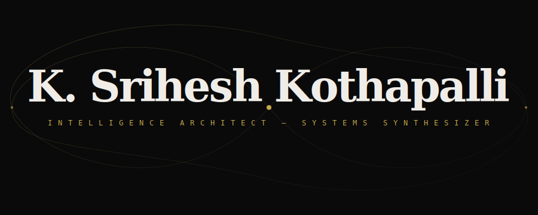
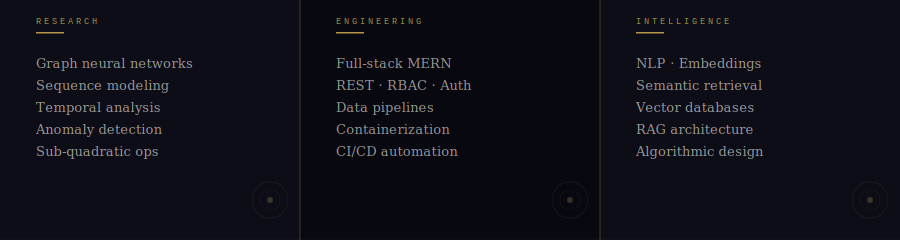
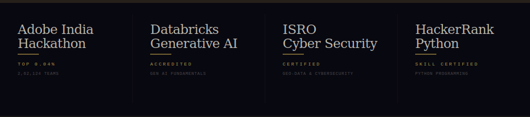

<picture>
  <source media="(prefers-color-scheme: dark)"  srcset="header_dark.svg">
  <source media="(prefers-color-scheme: light)" srcset="header_light.svg">
  
</picture>

<picture>
  <source media="(prefers-color-scheme: dark)"  srcset="skills_dark.svg">
  <source media="(prefers-color-scheme: light)" srcset="skills_light.svg">
  
</picture>

<picture>
  <source media="(prefers-color-scheme: dark)"  srcset="awards_dark.svg">
  <source media="(prefers-color-scheme: light)" srcset="awards_light.svg">
  
</picture>

 

  

&nbsp;

&nbsp;

 

<i>nodes compressed &nbsp;·&nbsp; noise filtered &nbsp;·&nbsp; context preserved</i>

