<picture>
  <source media="(prefers-color-scheme: dark)" srcset="header_dark.svg">
  <source media="(prefers-color-scheme: light)" srcset="header_light.svg">
  
</picture>

 

### I N T E L L I G E N C E &nbsp; | &nbsp; S Y S T E M S &nbsp; | &nbsp; S T R U C T U R E
*An intersection of high-dimensional theory and practical architecture.*

 

<table width="100%" border="0" cellpadding="20" cellspacing="0">
  <tr>
    <td width="50%" valign="top">
      <h4>THE RESEARCH PHILOSOPHY</h4>
      

        Investigating the geometric properties of social connectivity through Graph Neural Networks. The focus remains on sub-quadratic global tracking and hierarchical tokenization—distilling complex network noise into structured signals without the burden of traditional computational overhead.
      

    </td>
    <td width="50%" valign="top">
      <h4>THE ARCHITECTURAL MISSION</h4>
      

        Constructing resilient full-stack ecosystems designed for high-availability. From centralized passenger assistance platforms to automated infrastructure recovery, the goal is to bridge human intent with machine efficiency through clean, modular engineering.
      

    </td>
  </tr>
</table>

 

---

 

### C O M P E T E N C I E S
*Identities defined by technical execution.*

| ROLE | DOMAIN EXPERTISE |
| :--- | :--- |
| **Intelligence Architect** | Neural Graph Structures · Machine Learning Pipelines · Predictive Modeling |
| **Systems Synthesizer** | Full-Stack Development · MERN Orchestration · Logic Design |
| **Cloud Strategist** | Automated Recovery Systems · S3/EC2 Architecture · AWS Integration |
| **Technical Researcher** | Algorithmic Innovation · Semantic Retrieval · Data Sovereignty |

 

---

 

### S T A T I S T I C S

 

&nbsp;

 

  

[L I N K E D I N](https://linkedin.com/in/srihesh-kothapalli) &nbsp; · &nbsp; [G I T H U B](https://github.com/Srihesh) &nbsp; · &nbsp; [M A I L](mailto:sriheshk06@gmail.com)

 

<i>nodes compressed &nbsp;·&nbsp; noise filtered &nbsp;·&nbsp; context preserved. Verified 2026.</i>

